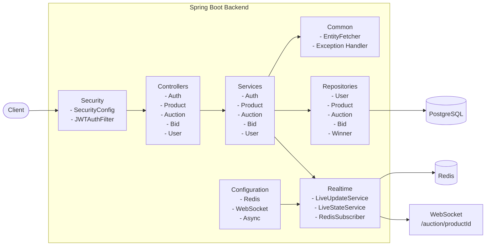
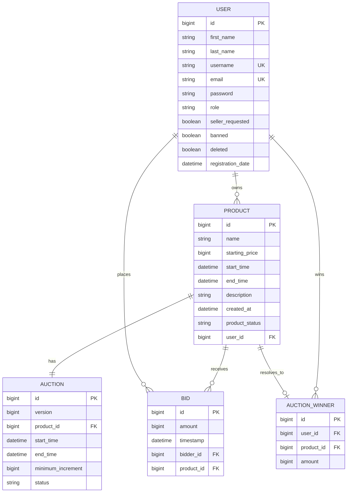
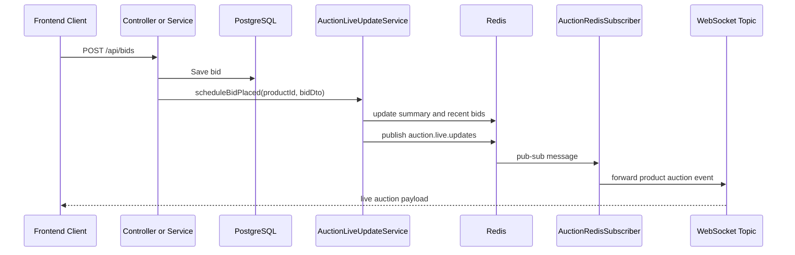

## Project Overview

This backend powers FlashBid, a real-time auction platform built with Spring Boot. It is responsible for authentication, authorization, product and auction management, bidding rules, winner resolution, realtime auction broadcasting, and persistence.

The backend exposes REST APIs under `/api/*`, broadcasts live auction updates over WebSocket/SockJS, stores relational data in PostgreSQL, and uses Redis for live auction summaries, recent bids, and auction scheduling indexes.

## Features

- JWT-based authentication and stateless authorization
- Role-based access control for `USER`, `SELLER`, and `ADMIN`
- Product creation, listing, filtering, update, and deletion flows
- Auction creation, status transitions, force-close, and winner handling
- Bid placement with business-rule validation
- Realtime auction updates over WebSocket
- Redis-backed live summary caching and pub/sub distribution
- Swagger/OpenAPI documentation for backend APIs
- Centralized exception handling with structured error responses

## Tech Stack

- Java 21
- Spring Boot 3.4.3
- Spring Security
- Spring Data JPA
- Spring WebSocket
- Spring Data Redis
- PostgreSQL
- Redis
- JWT via `jjwt`
- OpenAPI via `springdoc-openapi`
- Maven

## Architecture Diagram



## Project Structure

- `src/main/java/com/example/flashbid/auth`
  Authentication, JWT services, Spring Security configuration, and user-details integration
- `src/main/java/com/example/flashbid/product`
  Product entities, DTOs, controller, repository, and service logic
- `src/main/java/com/example/flashbid/bid`
  Bid entities, DTOs, controller, repository, and bid validation logic
- `src/main/java/com/example/flashbid/auction`
  Auction and winner entities, controllers, lifecycle services, and scheduler logic
- `src/main/java/com/example/flashbid/user`
  User entities, profile APIs, seller request flow, and admin moderation
- `src/main/java/com/example/flashbid/common/config`
  Redis, WebSocket, Jackson, async, and timezone configuration
- `src/main/java/com/example/flashbid/common/redis`
  Realtime event building, Redis cache access, Redis pub/sub, and websocket fan-out
- `src/main/java/com/example/flashbid/common/exception`
  Shared exception classes and global exception handling
- `src/main/java/com/example/flashbid/common/util`
  Shared helpers such as current-user and entity fetching
- `src/main/resources`
  Spring application configuration files
- `src/test`
  Backend tests

## Database Schema



## Authentication Flow

The backend uses stateless JWT authentication.

### Login/Register Flow

1. The client sends a request to `/api/auth/register` or `/api/auth/login`.
2. `AuthController` forwards the request to `AuthService`.
3. Credentials are validated and passwords are checked with Spring Security and `BCryptPasswordEncoder`.
4. On success, the backend returns a JWT in the auth response.
5. The client stores the token and sends it in the `Authorization: Bearer <token>` header on protected requests.

### Protected Request Flow

1. The request enters the Spring Security filter chain.
2. `JWTAuthFilter` extracts and validates the token using `JWTService`.
3. `UserInfoService` loads the authenticated user details.
4. Spring Security populates the security context.
5. Controllers and `@PreAuthorize` checks enforce route-level and role-level access.

### Public Endpoints

- `/api/auth/**`
- `/swagger-ui.html`
- `/swagger-ui/**`
- `/api/apidocs`
- `/api/apidocs/**`
- `/ws/**`
- `GET /api/products/**`
- `GET /api/auctions/winner/**`

## Auction Flow

### Auction Creation

1. A seller or admin creates a product through `ProductService`.
2. The service creates both:
  - a `Product` row
  - an `Auction` row linked one-to-one to that product
3. New auctions begin in `SCHEDULED` state.
4. A live refresh event is scheduled so Redis and websocket state are initialized.

### Auction State Lifecycle

The backend uses three effective states:

- `SCHEDULED`
- `OPEN`
- `CLOSED`


## WebSocket Flow

The backend supports live auction updates through WebSocket + SockJS.

### WebSocket Entry Point

- endpoint: `/ws`
- broker topic pattern: `/topic/auctions/{productId}`

### Realtime Flow



## API Endpoints

### Auth

- `POST /api/auth/register`
- `POST /api/auth/login`

### Products

- `GET /api/products`
- `GET /api/products/{productId}`
- `GET /api/products/user/{userId}`
- `POST /api/products`
- `PUT /api/products/{id}`
- `DELETE /api/products/{productId}`

### Bids

- `POST /api/bids`
- `GET /api/bids/product/{productId}`
- `GET /api/bids/user/{userId}`

### Users

- `GET /api/user/me`
- `GET /api/user/{id}`
- `GET /api/user/all`
- `PUT /api/user/{userId}`
- `DELETE /api/user/{id}`
- `POST /api/user/me/seller-request`
- `PATCH /api/user/{id}/seller-approval`
- `PATCH /api/user/{id}/ban`

### Auctions

- `POST /api/auctions/{productId}/close`
- `GET /api/auctions/winner/{productId}`

### API Docs

- Swagger UI: `http://localhost:8080/swagger-ui.html`
- OpenAPI JSON: `http://localhost:8080/api/apidocs`

### Config Files

- [src/main/resources/application.yml](/home/aniket/IdeaProjects/flashbid/backend/src/main/resources/application.yml)
- [src/main/resources/application-local.yml](/home/aniket/IdeaProjects/flashbid/backend/src/main/resources/application-local.yml)

### Environment Variables

- `PORT`
  Backend server port, default `8080`
- `SPRING_DATASOURCE_URL`
  PostgreSQL JDBC URL
- `SPRING_DATASOURCE_USERNAME`
  PostgreSQL username
- `SPRING_DATASOURCE_PASSWORD`
  PostgreSQL password
- `SPRING_JWT_SECRET`
  JWT signing secret
- `APP_TIMEZONE`
  Application timezone
- `APP_ALLOWED_ORIGINS`
  Allowed HTTP and WebSocket origins
- `APP_REDIS_PUBSUB_ENABLED`
  Enables Redis pub/sub listener behavior

## Running the Project

### Prerequisites

Make sure the following tools are installed before running the project:

| Tool | Recommended Version |
|------|---------------------|
| Java | 21 |
| Maven | 3.9+ |
| Docker | Latest |
| Docker Compose | Latest |

Verify your installation:

```bash
java -version
docker --version
docker compose version
```

---

### Using Docker Compose (Recommended)

From the repository root:

```bash
docker-compose up -d
```

This starts:

- PostgreSQL (`localhost:5432`)
- Redis (`localhost:6379`)
- Backend API (`localhost:8080`)

If this is your first run or you've made backend changes, rebuild the Docker image:

```bash
docker-compose up -d --build
```

---

### Running the Backend Locally

If you prefer to run the Spring Boot application outside Docker:

1. Start only the required services:

```bash
docker-compose up -d db redis
```

2. From the `backend/` directory, start the application:

```bash
./mvnw spring-boot:run -Dspring-boot.run.profiles=local
```

The backend will connect to:

- PostgreSQL: `localhost:5432`
- Redis: `localhost:6379`